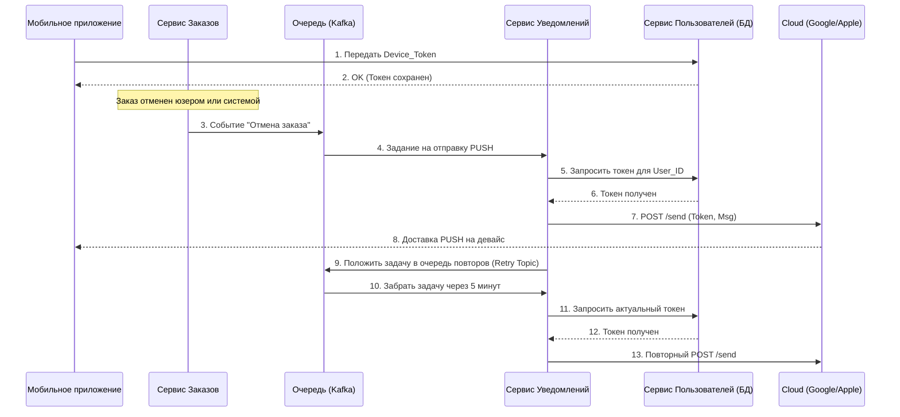

# Тестовое задание на позицию Системного Аналитика

## **Задание 1:** Анализ требований
### **1. Найти и перечислить все логические противоречия.**  

1. **Проблема:**  п.1 разрешает 10 единиц одного товара, п.3 разрешает 5 разных товаров (итого 50 ед.), но п.4 ограничивает корзину 20 единицами. Это блокирует добавление товаров до заполнения лимита позиций.  
2. **Проблема:**  п.2 запрещает уменьшать количество менее чем до 1 и требует отдельную кнопку для удаления. п.9, напротив, велит удалять товар при достижении 0. Это путает разработчика и пользователя.  
3. **Проблема:**  п.7 требует фиксации цены в момент добавления, а п.13 - автоматического обновления при изменении в каталоге. Эти требования взаимоисключающие.  
4. **Проблема:**  Формулировка «по утрам и вечерам» является нетехнической. Не указаны конкретные временные интервалы и часовой пояс (серверный или локальный пояс пользователя).  

### **2. Предложить конкретные исправления для устранения этих противоречий.**

1. **Пункты 1, 3, 4**  
Максимальное количество позиций в корзине - 5 различных артикулов.  
Суммарное количество единиц всех товаров в корзине не может превышать 20 штук.  
Количество единиц одного товара может варьироваться от 1 до 20 (в рамках общего лимита корзины).  

2. **Пункты 2, 9**  
Изменение количества товара производится кнопками "+" и "-". Минимальное количество товара в позиции - 1 шт.  
При попытке уменьшить количество товара (нажатие "-"), когда в корзине уже 1 шт., система должна запрашивать подтверждение удаления товара или игнорировать действие.  
Полное удаление товара из корзины осуществляется только нажатием на кнопку "Удалить" (иконка корзины).  
Логика следующая: через "ноль" не удаляем, чтобы избежать случайных нажатий.  

3. **Пункты 7, 13**  
Цена на товар в корзине не является фиксированной и должна соответствовать актуальной цене в каталоге интернет-магазина.  
При изменении цены в каталоге, стоимость товара в корзине пользователя обновляется автоматически (согласно п.13).  
Дополнение: Если цена на товар в корзине изменилась с момента его добавления, система должна визуально выделить этот товар (например, цветовым индикатором)   
и отобразить информационное сообщение: "Цена на товар в вашей корзине изменилась".  

4. **Пункт 11**  
В интерфейсе корзины предусмотрен блок для отображения рекламных баннеров (внутренних акций или партнерских предложений).  
Условие отображения: Блок активен в будние дни (Пн-Пт) в следующие временные интервалы: с 08:00 до 11:00 и с 18:00 до 21:00.  
Часовой пояс: Время отображения рассчитывается по локальному часовому поясу пользователя (на основе настроек устройства или данных геолокации).  
Пустое состояние: Вне указанных интервалов (включая выходные дни) рекламный блок должен быть скрыт, а полезное пространство корзины -перераспределено под список товаров.  

Я допустила, что  пункт про рекламу выглядит как блок товарных рекомендаций, адаптированный под время суток. 
Это позволяет повысить средний чек, предлагая актуальные продукты вместо статичных баннеров.

### **3. Уточняющие вопромы PM или бизнес-заказчику**  

1. **По приоритету цен:** Какая бизнес-цель приоритетнее: гарантировать пользователю цену «как при добавлении» (лояльность) или поддерживать актуальную маржинальность (обновление по каталогу)?  
2. **По поведению корзины:** Что должно происходить с товаром в корзине, если он закончился на складе (остаток = 0)? Нужно ли его удалять или помечать как «нет в наличии»?  
3. **По рекламному блоку:** Какой контент должен отображаться в рекламном блоке в выходные дни и в дневное/ночное время? Должен ли блок скрываться или отображать «заглушку»?  
4. **По лимитам:** Должна ли кнопка добавления в корзину блокироваться в каталоге, если общий лимит (20 ед.) уже достигнут?  


### **Раздел 2:** Проектирование REST API (Магазины)  

Для отображения списка магазинов-партнеров на новом экране спроектирован метод получения данных.

### Описание запроса
* **Метод:** `GET`
* **Эндпоинт:** `/api/v1/shops`
* **Параметры запроса (Query Params):**
    * `city_id` — ID города для фильтрации доступных магазинов.
    * `lat`, `lon` — географические координаты пользователя для расчета времени доставки.

**Пример запроса:**
`GET https://petrushka.green/api/v1/shops`

### Пример ответа (JSON)
В ответе учтена разница в форматах отображения доставки (интервалы времени vs минуты) и наличие ссылки для перехода на внешний ресурс.

```json
{
  "status": "success",
  "data": {
    "title": "Выберите магазин",
    "shops": [
      {
        "id": 101,
        "name": "METRO",
        "logo_url": "https://petrushka.green",
        "external_url": "https://metro-cc.ru",
        "delivery_info": {
          "type": "interval",
          "text": "Сегодня, 21:00 – 23:00"
        }
      },
      {
        "id": 103,
        "name": "ВкусВилл",
        "logo_url": "https://petrushka.green",
        "external_url": "https://vkusvill.ru",
        "delivery_info": {
          "type": "express",
          "text": "20 – 60 мин"
        }
      }
    ]
  }
}
```


### **Раздел 3:** Проектирование PUSH-уведомлений (UML)


